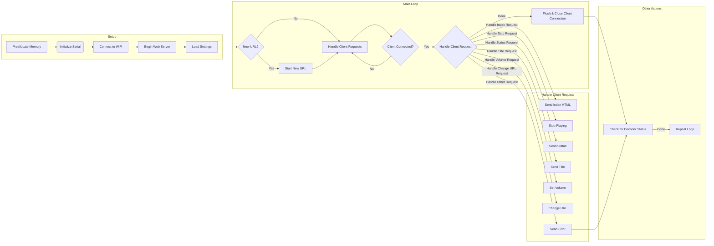

# Practica 7.B. Web Radio 
## Objetivos: 
- El objetivo de la practica actual es describir el funcionamiento del bus I2S y realizar una
practica para comprender su funcionamiento
- Reproducir sonido des de una pagina web sincronizando la radio.
## Materiales: 
- ESP32-S1 
- Altavoz I2S 
- Amplificador I2S
- Libreria:
```
    lib_deps = earlephilhower/ESP8266Audio@^1.9.0
```
## Procedimiento: 
### Programa principal:
**Código:**
```cpp
    #include <Arduino.h>
    #if defined(ARDUINO_ARCH_RP2040)
    void setup() {}
    void loop() {}
    #else

    // ESP8266 server.available() is now server.accept()
    #pragma GCC diagnostic ignored "-Wdeprecated-declarations"

    #if defined(ESP32)
        #include <WiFi.h>
    #else
        #include <ESP8266WiFi.h>
    #endif
    #include "AudioFileSourceICYStream.h"
    #include "AudioFileSourceBuffer.h"
    #include "AudioGeneratorMP3.h"
    #include "AudioGeneratorAAC.h"
    #include "AudioOutputI2S.h"
    #include <EEPROM.h>

    // Custom web server that doesn't need much RAM
    #include "web.h"

    // To run, set your ESP8266 build to 160MHz, update the SSID info, and upload.

    // Enter your WiFi setup here:
    #ifndef STASSID
    #define STASSID "OPPO BernArtNet"
    #define STAPSK  "putaespanya1"
    #endif


    const char* ssid = STASSID;
    const char* password = STAPSK;

    WiFiServer server(80);

    AudioGenerator *decoder = NULL;
    AudioFileSourceICYStream *file = NULL;
    AudioFileSourceBuffer *buff = NULL;
    AudioOutputI2S *out = NULL;

    void RedirectToIndex(WiFiClient *client);
    void LoadSettings();
    void SaveSettings();

    int volume = 100;
    char title[64];
    char url[96];
    char status[64];
    bool newUrl = false;
    bool isAAC = false;
    int retryms = 0;

    typedef struct {
    char url[96];
    bool isAAC;
    int16_t volume;
    int16_t checksum;
    } Settings;

    // C++11 multiline string constants are neato...
    static const char HEAD[] PROGMEM = R"KEWL(
    <head>
    <title>ESP8266 Web Radio</title>
    <script type="text/javascript">
    function updateTitle() {
        var x = new XMLHttpRequest();
        x.open("GET", "title");
        x.onload = function() { document.getElementById("titlespan").innerHTML=x.responseText; setTimeout(updateTitle, 5000); }
        x.onerror = function() { setTimeout(updateTitle, 5000); }
        x.send();
    }
    setTimeout(updateTitle, 1000);
    function showValue(n) {
        document.getElementById("volspan").innerHTML=n;
        var x = new XMLHttpRequest();
        x.open("GET", "setvol?vol="+n);
        x.send();
    }
    function updateStatus() {var x = new XMLHttpRequest();
        x.open("GET", "status");
        x.onload = function() { document.getElementById("statusspan").innerHTML=x.responseText; setTimeout(updateStatus, 5000); }
        x.onerror = function() { setTimeout(updateStatus, 5000); }
        x.send();
    }
    setTimeout(updateStatus, 2000);
    </script>
    </head>)KEWL";

    static const char BODY[] PROGMEM = R"KEWL(
    <body>
    ESP8266 Web Radio!
    <hr>
    Currently Playing: <span id="titlespan">%s</span><br>
    Volume: <input type="range" name="vol" min="1" max="150" steps="10" value="%d" onchange="showValue(this.value)"/> <span id="volspan">%d</span>%%
    <hr>
    Status: <span id="statusspan">%s</span>
    <hr>
    <form action="changeurl" method="GET">
    Current URL: %s<br>
    Change URL: <input type="text" name="url">
    <select name="type"><option value="mp3">MP3</option><option value="aac">AAC</option></select>
    <input type="submit" value="Change"></form>
    <form action="stop" method="POST"><input type="submit" value="Stop"></form>
    </body>)KEWL";

    void HandleIndex(WiFiClient *client)
    {
    char buff[sizeof(BODY) + sizeof(title) + sizeof(status) + sizeof(url) + 3*2];
    
    Serial.printf_P(PSTR("Sending INDEX...Free mem=%d\n"), ESP.getFreeHeap());
    WebHeaders(client, NULL);
    WebPrintf(client, DOCTYPE);
    client->write_P( PSTR("<html>"), 6 );
    client->write_P( HEAD, strlen_P(HEAD) );
    sprintf_P(buff, BODY, title, volume, volume, status, url);
    client->write(buff, strlen(buff) );
    client->write_P( PSTR("</html>"), 7 );
    Serial.printf_P(PSTR("Sent INDEX...Free mem=%d\n"), ESP.getFreeHeap());
    }

    void HandleStatus(WiFiClient *client)
    {
    WebHeaders(client, NULL);
    client->write(status, strlen(status));
    }

    void HandleTitle(WiFiClient *client)
    {
    WebHeaders(client, NULL);
    client->write(title, strlen(title));
    }

    void HandleVolume(WiFiClient *client, char *params)
    {
    char *namePtr;
    char *valPtr;
    
    while (ParseParam(&params, &namePtr, &valPtr)) {
        ParamInt("vol", volume);
    }
    Serial.printf_P(PSTR("Set volume: %d\n"), volume);
    out->SetGain(((float)volume)/100.0);
    RedirectToIndex(client);
    }

    void HandleChangeURL(WiFiClient *client, char *params)
    {
    char *namePtr;
    char *valPtr;
    char newURL[sizeof(url)];
    char newType[4];

    newURL[0] = 0;
    newType[0] = 0;
    while (ParseParam(&params, &namePtr, &valPtr)) {
        ParamText("url", newURL);
        ParamText("type", newType);
    }
    if (newURL[0] && newType[0]) {
        newUrl = true;
        strncpy(url, newURL, sizeof(url)-1);
        url[sizeof(url)-1] = 0;
        if (!strcmp_P(newType, PSTR("aac"))) {
        isAAC = true;
        } else {
        isAAC = false;
        }
        strcpy_P(status, PSTR("Changing URL..."));
        Serial.printf_P(PSTR("Changed URL to: %s(%s)\n"), url, newType);
        RedirectToIndex(client);
    } else {
        WebError(client, 404, NULL, false);
    }
    }

    void RedirectToIndex(WiFiClient *client)
    {
    WebError(client, 301, PSTR("Location: /\r\n"), true);
    }

    void StopPlaying()
    {
    if (decoder) {
        decoder->stop();
        delete decoder;
        decoder = NULL;
    }
    if (buff) {
        buff->close();
        delete buff;
        buff = NULL;
    }
    if (file) {
        file->close();
        delete file;
        file = NULL;
    }
    strcpy_P(status, PSTR("Stopped"));
    strcpy_P(title, PSTR("Stopped"));
    }

    void HandleStop(WiFiClient *client)
    {
    Serial.printf_P(PSTR("HandleStop()\n"));
    StopPlaying();
    RedirectToIndex(client);
    }

    void MDCallback(void *cbData, const char *type, bool isUnicode, const char *str)
    {
    const char *ptr = reinterpret_cast<const char *>(cbData);
    (void) isUnicode; // Punt this ball for now
    (void) ptr;
    if (strstr_P(type, PSTR("Title"))) { 
        strncpy(title, str, sizeof(title));
        title[sizeof(title)-1] = 0;
    } else {
        // Who knows what to do?  Not me!
    }
    }
    void StatusCallback(void *cbData, int code, const char *string)
    {
    const char *ptr = reinterpret_cast<const char *>(cbData);
    (void) code;
    (void) ptr;
    strncpy_P(status, string, sizeof(status)-1);
    status[sizeof(status)-1] = 0;
    }

    #ifdef ESP8266
    const int preallocateBufferSize = 5*1024;
    const int preallocateCodecSize = 29192; // MP3 codec max mem needed
    #else
    const int preallocateBufferSize = 16*1024;
    const int preallocateCodecSize = 85332; // AAC+SBR codec max mem needed
    #endif
    void *preallocateBuffer = NULL;
    void *preallocateCodec = NULL;

    void setup()
    {
    // First, preallocate all the memory needed for the buffering and codecs, never to be freed
    preallocateBuffer = malloc(preallocateBufferSize);
    preallocateCodec = malloc(preallocateCodecSize);
    if (!preallocateBuffer || !preallocateCodec) {
        Serial.begin(115200);
        Serial.printf_P(PSTR("FATAL ERROR:  Unable to preallocate %d bytes for app\n"), preallocateBufferSize+preallocateCodecSize);
        while (1) delay(1000); // Infinite halt
    }

    Serial.begin(115200);

    delay(1000);
    Serial.printf_P(PSTR("Connecting to WiFi\n"));

    WiFi.disconnect();
    WiFi.softAPdisconnect(true);
    WiFi.mode(WIFI_STA);
    
    WiFi.begin(ssid, password);

    // Try forever
    while (WiFi.status() != WL_CONNECTED) {
        Serial.printf_P(PSTR("...Connecting to WiFi\n"));
        delay(1000);
    }
    Serial.printf_P(PSTR("Connected\n"));
    
    Serial.printf_P(PSTR("Go to http://"));
    Serial.print(WiFi.localIP());
    Serial.printf_P(PSTR("/ to control the web radio.\n"));

    server.begin();
    
    strcpy_P(url, PSTR("none"));
    strcpy_P(status, PSTR("OK"));
    strcpy_P(title, PSTR("Idle"));

    audioLogger = &Serial;
    file = NULL;
    buff = NULL;
    out = new AudioOutputI2S();
    decoder = NULL;

    LoadSettings();
    }

    void StartNewURL()
    {
    Serial.printf_P(PSTR("Changing URL to: %s, vol=%d\n"), url, volume);

    newUrl = false;
    // Stop and free existing ones
    Serial.printf_P(PSTR("Before stop...Free mem=%d\n"), ESP.getFreeHeap());
    StopPlaying();
    Serial.printf_P(PSTR("After stop...Free mem=%d\n"), ESP.getFreeHeap());
    SaveSettings();
    Serial.printf_P(PSTR("Saved settings\n"));
    
    file = new AudioFileSourceICYStream(url);
    Serial.printf_P(PSTR("created icystream\n"));
    file->RegisterMetadataCB(MDCallback, NULL);
    buff = new AudioFileSourceBuffer(file, preallocateBuffer, preallocateBufferSize);
    Serial.printf_P(PSTR("created buffer\n"));
    buff->RegisterStatusCB(StatusCallback, NULL);
    decoder = isAAC ? (AudioGenerator*) new AudioGeneratorAAC(preallocateCodec, preallocateCodecSize) : (AudioGenerator*) new AudioGeneratorMP3(preallocateCodec, preallocateCodecSize);
    Serial.printf_P(PSTR("created decoder\n"));
    decoder->RegisterStatusCB(StatusCallback, NULL);
    Serial.printf_P("Decoder start...\n");
    decoder->begin(buff, out);
    out->SetGain(((float)volume)/100.0);
    if (!decoder->isRunning()) {
        Serial.printf_P(PSTR("Can't connect to URL"));
        StopPlaying();
        strcpy_P(status, PSTR("Unable to connect to URL"));
        retryms = millis() + 2000;
    }
    Serial.printf_P("Done start new URL\n");
    }

    void LoadSettings()
    {
    // Restore from EEPROM, check the checksum matches
    Settings s;
    uint8_t *ptr = reinterpret_cast<uint8_t *>(&s);
    EEPROM.begin(sizeof(s));
    for (size_t i=0; i<sizeof(s); i++) {
        ptr[i] = EEPROM.read(i);
    }
    EEPROM.end();
    int16_t sum = 0x1234;
    for (size_t i=0; i<sizeof(url); i++) sum += s.url[i];
    sum += s.isAAC;
    sum += s.volume;
    if (s.checksum == sum) {
        strcpy(url, s.url);
        isAAC = s.isAAC;
        volume = s.volume;
        Serial.printf_P(PSTR("Resuming stream from EEPROM: %s, type=%s, vol=%d\n"), url, isAAC?"AAC":"MP3", volume);
        newUrl = true;
    }
    }

    void SaveSettings()
    {
    // Store in "EEPROM" to restart automatically
    Settings s;
    memset(&s, 0, sizeof(s));
    strcpy(s.url, url);
    s.isAAC = isAAC;
    s.volume = volume;
    s.checksum = 0x1234;
    for (size_t i=0; i<sizeof(url); i++) s.checksum += s.url[i];
    s.checksum += s.isAAC;
    s.checksum += s.volume;
    uint8_t *ptr = reinterpret_cast<uint8_t *>(&s);
    EEPROM.begin(sizeof(s));
    for (size_t i=0; i<sizeof(s); i++) {
        EEPROM.write(i, ptr[i]);
    }
    EEPROM.commit();
    EEPROM.end();
    }

    void PumpDecoder()
    {
    if (decoder && decoder->isRunning()) {
        strcpy_P(status, PSTR("Playing")); // By default we're OK unless the decoder says otherwise
        if (!decoder->loop()) {
        Serial.printf_P(PSTR("Stopping decoder\n"));
        StopPlaying();
        retryms = millis() + 2000;
        }
    }

    }

    void loop()
    {
    static int lastms = 0;
    if (millis()-lastms > 1000) {
        lastms = millis();
        Serial.printf_P(PSTR("Running for %d seconds%c...Free mem=%d\n"), lastms/1000, !decoder?' ':(decoder->isRunning()?'*':' '), ESP.getFreeHeap());
    }

    if (retryms && millis()-retryms>0) {
        retryms = 0;
        newUrl = true;
    }
    
    if (newUrl) {
        StartNewURL();
    }

    PumpDecoder();
    
    char *reqUrl;
    char *params;
    WiFiClient client = server.available();
    PumpDecoder();
    char reqBuff[384];
    if (client && WebReadRequest(&client, reqBuff, 384, &reqUrl, &params)) {
        PumpDecoder();
        if (IsIndexHTML(reqUrl)) {
        HandleIndex(&client);
        } else if (!strcmp_P(reqUrl, PSTR("stop"))) {
        HandleStop(&client);
        } else if (!strcmp_P(reqUrl, PSTR("status"))) {
        HandleStatus(&client);
        } else if (!strcmp_P(reqUrl, PSTR("title"))) {
        HandleTitle(&client);
        } else if (!strcmp_P(reqUrl, PSTR("setvol"))) {
        HandleVolume(&client, params);
        } else if (!strcmp_P(reqUrl, PSTR("changeurl"))) {
        HandleChangeURL(&client, params);
        } else {
        WebError(&client, 404, NULL, false);
        }
        // web clients hate when door is violently shut
        while (client.available()) {
        PumpDecoder();
        client.read();
        }
    }
    PumpDecoder();
    if (client) {
        client.flush();
        client.stop();
    }
    }

    #endif
```
**Descripción:**<br>
Programa para una radio web basada en ESP8266 o ESP32. Incluye configuración de WiFi, manejo de URLs de transmisión de audio y un servidor web simple para controlar la radio desde un navegador.
Al inicio, el código verifica si se está ejecutando en un Arduino con arquitectura RP2040. Si es así, las funciones ``setup`` y ``loop`` quedan vacías. Para otras plataformas, configura la red WiFi y los componentes de audio necesarios.
La configuración de la red WiFi se realiza especificando el SSID y la contraseña, y se intenta conectar hasta que se establece la conexión. Una vez conectado, se inicia un servidor web en el puerto 80.
El servidor web permite a los usuarios controlar la radio mediante un navegador web. El código HTML embebido genera una página web que muestra el título de la canción actual, el volumen, el estado de la radio y permite cambiar la URL de la transmisión. Los cambios en el volumen y la URL se manejan mediante JavaScript y solicitudes GET.
La lógica de decodificación de audio incluye la inicialización de fuentes de audio, buffers y decodificadores de MP3 o AAC según el tipo de URL proporcionada. El bucle principal (``loop``) maneja la conexión del cliente, procesa solicitudes HTTP y ejecuta la decodificación del audio.
Las configuraciones de la radio se guardan en EEPROM para poder restaurarlas al reiniciar. Se implementan funciones de callback para manejar metadatos y estados del decodificador, así como para actualizar el estado de la radio en la página web.
Cuando se recibe una solicitud de cambio de URL, se detiene la transmisión actual, se guarda la configuración y se inicia la nueva transmisión. Si la conexión falla, se reintenta después de un intervalo.
El programa está diseñado para funcionar con una mínima cantidad de RAM, usando un servidor web personalizado y preasignando memoria para buffering y decodificación de audio.
**Página web:**
```cpp
    #include <Arduino.h>
    #if defined(ARDUINO_ARCH_RP2040)
    // Nothing here
    #else
    #ifdef ESP32
        #include <WiFi.h>
    #else
        #include <ESP8266WiFi.h>
    #endif
    #include "web.h"

    void WebPrintError(WiFiClient *client, int code)
    {
    switch(code) {
        case 301: WebPrintf(client, "301 Moved Permanently"); break;
        case 400: WebPrintf(client, "400 Bad Request"); break;
        case 401: WebPrintf(client, "401 Unauthorized"); break;
        case 404: WebPrintf(client, "404 Not Found"); break;
        case 405: WebPrintf(client, "405 Method Not Allowed"); break;
        default:  WebPrintf(client, "500 Server Error"); break;
    }
    }


    void WebError(WiFiClient *client, int code, const char *headers, bool usePMEM)
    {
    WebPrintf(client, "HTTP/1.1 %d\r\n", code);
    WebPrintf(client, "Server: PsychoPlug\r\n");
    WebPrintf(client, "Content-type: text/html\r\n");
    WebPrintf(client, "Cache-Control: no-cache, no-store, must-revalidate\r\n");
    WebPrintf(client, "Pragma: no-cache\r\n");
    WebPrintf(client, "Expires: 0\r\n");
    WebPrintf(client, "Connection: close\r\n");
    if (headers) {
        if (!usePMEM) {
        WebPrintf(client, "%s", headers);
        } else {
        WebPrintfPSTR(client, headers);
        }
    }
    WebPrintf(client, "\r\n\r\n");
    WebPrintf(client, DOCTYPE);
    WebPrintf(client, "<html><head><title>");
    WebPrintError(client, code);
    WebPrintf(client, "</title>" ENCODING "</head>\n");
    WebPrintf(client, "<body><h1>");
    WebPrintError(client, code);
    WebPrintf(client, "</h1></body></html>\r\n");
    }


    void WebHeaders(WiFiClient *client, PGM_P /*const char **/headers)
    {
    WebPrintf(client, "HTTP/1.1 200 OK\r\n");
    WebPrintf(client, "Server: PsychoPlug\r\n");
    WebPrintf(client, "Content-type: text/html\r\n");
    WebPrintf(client, "Cache-Control: no-cache, no-store, must-revalidate\r\n");
    WebPrintf(client, "Pragma: no-cache\r\n");
    WebPrintf(client, "Connection: close\r\n");
    WebPrintf(client, "Expires: 0\r\n");
    if (headers) {
        WebPrintfPSTR(client, headers);
    }
    WebPrintf(client, "\r\n");
    }


    // In-place decoder, overwrites source with decoded values.  Needs 0-termination on input
    // Try and keep memory needs low, speed not critical
    static uint8_t b64lut(uint8_t i)
    {
    if (i >= 'A' && i <= 'Z') return i - 'A';
    if (i >= 'a' && i <= 'z') return i - 'a' + 26;
    if (i >= '0' && i <= '9') return i - '0' + 52;
    if (i == '-') return 62;
    if (i == '_') return 63;
    else return 64;// sentinel
    }

    void Base64Decode(char *str)
    {
    char *dest;
    dest = str;

    if (strlen(str)%4) return; // Not multiple of 4 == error
    
    while (*str) {
        uint8_t a = b64lut(*(str++));
        uint8_t b = b64lut(*(str++));
        uint8_t c = b64lut(*(str++));
        uint8_t d = b64lut(*(str++));
        *(dest++) = (a << 2) | ((b & 0x30) >> 4);
        if (c == 64) break;
        *(dest++) = ((b & 0x0f) << 4) | ((c & 0x3c) >> 2);
        if (d == 64) break;
        *(dest++) = ((c & 0x03) << 6) | d;
    }
    *dest = 0; // Terminate the string
    }


    void URLDecode(char *ptr)
    {
    while (*ptr) {
        if (*ptr == '+') {
        *ptr = ' ';
        } else if (*ptr == '%') {
        if (*(ptr+1) && *(ptr+2)) {
            byte a = *(ptr + 1);
            byte b = *(ptr + 2);
            if (a>='0' && a<='9') a -= '0';
            else if (a>='a' && a<='f') a = a - 'a' + 10;
            else if (a>='A' && a<='F') a = a - 'A' + 10;
            if (b>='0' && b<='9') b -= '0';
            else if (b>='a' && b<='f') b = b - 'a' + 10;
            else if (b>='A' && b<='F') b = b - 'A' + 10;
            *ptr = ((a&0x0f)<<4) | (b&0x0f);
            // Safe strcpy the rest of the string back
            char *p1 = ptr + 1;
            char *p2 = ptr + 3;
            while (*p2) { *p1 = *p2; p1++; p2++; }
            *p1 = 0;
        }
        // OTW this is a bad encoding, just pass unchanged
        }
        ptr++;
    }
    }

    // Parse HTTP request
    bool WebReadRequest(WiFiClient *client, char *reqBuff, int reqBuffLen, char **urlStr, char **paramStr)
    {
    static char NUL = 0; // Get around writable strings...

    *urlStr = NULL;
    *paramStr = NULL;

    unsigned long timeoutMS = millis() + 5000; // Max delay before we timeout
    while (!client->available() && millis() < timeoutMS) { delay(10); }
    if (!client->available()) {
        return false;
    }
    int wlen = client->readBytesUntil('\r', reqBuff, reqBuffLen-1);
    reqBuff[wlen] = 0;

    
    // Delete HTTP version (well, anything after the 2nd space)
    char *ptr = reqBuff;
    while (*ptr && *ptr!=' ') ptr++;
    if (*ptr) ptr++;
    while (*ptr && *ptr!=' ') ptr++;
    *ptr = 0;

    URLDecode(reqBuff);

    char *url;
    char *qp;
    if (!memcmp_P(reqBuff, PSTR("GET "), 4)) {
        client->flush(); // Don't need anything here...
        
        // Break into URL and form data
        url = reqBuff+4;
        while (*url && *url=='/') url++; // Strip off leading /s
        qp = strchr(url, '?');
        if (qp) {
        *qp = 0; // End URL
        qp++;
        } else {
        qp = &NUL;
        }
    } else if (!memcmp_P(reqBuff, PSTR("POST "), 5)) {
        uint8_t newline;
        client->read(&newline, 1); // Get rid of \n

        url = reqBuff+5;
        while (*url && *url=='/') url++; // Strip off leading /s
        qp = strchr(url, '?');
        if (qp) *qp = 0; // End URL @ ?
        // In a POST the params are in the body
        int sizeleft = reqBuffLen - strlen(reqBuff) - 1;
        qp = reqBuff + strlen(reqBuff) + 1;
        int wlen = client->readBytesUntil('\r', qp, sizeleft-1);
        qp[wlen] = 0;
        client->flush();
        URLDecode(qp);
    } else {
        // Not a GET or POST, error
        WebError(client, 405, PSTR("Allow: GET, POST"));
        return false;
    }

    if (urlStr) *urlStr = url;
    if (paramStr) *paramStr = qp;

    return true;
    }


    // Scan out and update a pointeinto the param string, returning the name and value or false if done
    bool ParseParam(char **paramStr, char **name, char **value)
    {
    char *data = *paramStr;
    
    if (*data==0) return false;
    
    char *namePtr = data;
    while ((*data != 0) && (*data != '=') && (*data != '&')) data++;
    if (*data) { *data = 0; data++; }
    char *valPtr = data;
    if  (*data == '=') data++;
    while ((*data != 0) && (*data != '=') && (*data != '&')) data++;
    if (*data) { *data = 0; data++;}
    
    *paramStr = data;
    *name = namePtr;
    *value = valPtr;

    return true;
    }

    bool IsIndexHTML(const char *url)
    {
    if (!url) return false;
    if (*url==0 || !strcmp_P(url, PSTR("/")) || !strcmp_P(url, PSTR("/index.html")) || !strcmp_P(url, PSTR("index.html"))) return true;
    else return false;
    }

    void WebFormText(WiFiClient *client, /*const char **/ PGM_P label, const char *name, const char *value, bool enabled)
    {
    WebPrintfPSTR(client, label);
    WebPrintf(client, ": <input type=\"text\" name=\"%s\" id=\"%s\" value=\"%s\" %s><br>\n", name, name, value, !enabled?"disabled":"");
    }
    void WebFormText(WiFiClient *client, /*const char **/ PGM_P label, const char *name, const int value, bool enabled)
    {
    WebPrintfPSTR(client, label);
    WebPrintf(client, ": <input type=\"text\" name=\"%s\" id=\"%s\" value=\"%d\" %s><br>\n", name, name, value, !enabled?"disabled":"");
    }
    void WebFormCheckbox(WiFiClient *client, /*const char **/ PGM_P label, const char *name, bool checked, bool enabled)
    {
    WebPrintf(client, "<input type=\"checkbox\" name=\"%s\" id=\"%s\" %s %s> ", name, name, checked?"checked":"", !enabled?"disabled":"");
    WebPrintfPSTR(client, label);
    WebPrintf(client, "<br>\n");
    }
    void WebFormCheckboxDisabler(WiFiClient *client, PGM_P /*const char **/label, const char *name, bool invert, bool checked, bool enabled, const char *ids[])
    {
    WebPrintf(client,"<input type=\"checkbox\" name=\"%s\" id=\"%s\" onclick=\"", name,name);
    if (invert) WebPrintf(client, "var x = true; if (this.checked) { x = false; }\n")
    else WebPrintf(client, "var x = false; if (this.checked) { x = true; }\n");
    for (byte i=0; ids[i][0]; i++ ) {
        WebPrintf(client, "document.getElementById('%s').disabled = x;\n", ids[i]);
    }
    WebPrintf(client, "\" %s %s> ", checked?"checked":"", !enabled?"disabled":"")
    WebPrintfPSTR(client, label);
    WebPrintf(client, "<br>\n");
    }

    // Scan an integer from a string, place it into dest, and then return # of bytes scanned
    int ParseInt(char *src, int *dest)
    {
    byte count = 0;
    bool neg = false;
    int res = 0;
    if (!src) return 0;
    if (src[0] == '-') {neg = true; src++; count++;}
    while (*src && (*src>='0') && (*src<='9')) {
        res = res * 10;
        res += *src - '0';
        src++;
        count++;
    }
    if (neg) res *= -1;
    if (dest) *dest = res;
    return count;
    }

    void Read4Int(char *str, byte *p)
    {
    int i;
    str += ParseInt(str, &i); p[0] = i; if (*str) str++;
    str += ParseInt(str, &i); p[1] = i; if (*str) str++;
    str += ParseInt(str, &i); p[2] = i; if (*str) str++;
    str += ParseInt(str, &i); p[3] = i;
    }
    #endif
```
**Descripción:**<br>
La función ``WebPrintError`` imprime mensajes de error HTTP en función del código de estado proporcionado. ``WebError`` se encarga de enviar una respuesta HTTP de error al cliente, mientras que ``WebHeaders`` establece los encabezados de respuesta HTTP.
La función ``Base64Decode`` decodifica una cadena codificada en Base64. ``URLDecode``, por otro lado, decodifica una cadena codificada con el formato de codificación de URL.
``WebReadRequest`` se encarga de leer una solicitud HTTP entrante, analizarla y separar la URL y los parámetros. ParseParam escanea y actualiza una cadena de parámetros, devolviendo el nombre y el valor del parámetro actual.
La función ``IsIndexHTML`` verifica si una URL dada es la página de inicio (index.html). Las funciones ``WebFormText``, ``WebFormCheckbox``, y WebFormCheckboxDisabler generan elementos de formulario HTML para texto y casillas de verificación, y también manejan la deshabilitación de elementos basados en la selección de una casilla de verificación.
Por último, ``ParseInt`` analiza un entero desde una cadena y lo coloca en una variable de destino, mientras que Read4Int lee cuatro enteros desde una cadena y los coloca en un arreglo de bytes.
## Diagrama de flujos:

## Conclusión:
Proporciona una radio web con capacidad de transmisión de audio en tiempo real, controlable a través de una interfaz web accesible desde cualquier navegador conectado a la misma red WiFi.